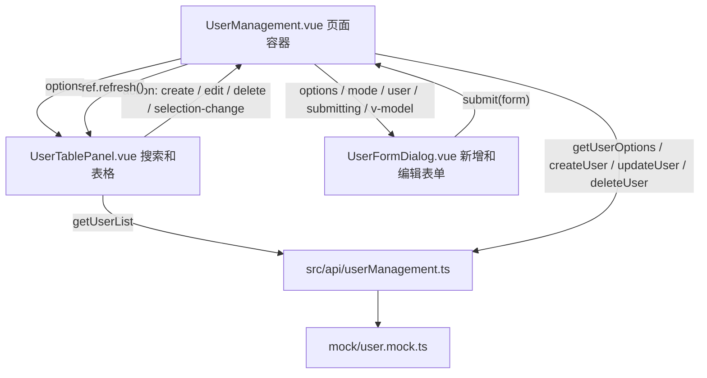

# 用户管理前端结构设计

本文档说明用户管理模块当前采用的前端结构、数据流和设计优势。该方式适用于列表查询、分页表格、新增、编辑、删除等典型后台管理页面。

## 设计目标

- 页面入口保持轻量，只负责编排子组件和处理跨组件业务动作。
- 搜索、表格、分页属于同一列表上下文，统一放在表格面板组件内部维护。
- 新增和编辑表单独立成弹窗组件，避免表格组件混入表单状态。
- 子组件对父组件只暴露清晰、有限的通信出口，降低 props 和事件数量。
- API 请求统一放在 `src/api`，mock 数据统一放在 `mock`，方便后续替换真实接口。

## 文件结构

```text
src/
  api/
    userManagement.ts
  views/
    SystemManagement/
      userManagement/
        UserManagement.vue
        types.ts
        components/
          UserTablePanel.vue
          UserFormDialog.vue
mock/
  user.mock.ts
```

各文件职责如下：

| 文件 | 职责 |
| --- | --- |
| `UserManagement.vue` | 页面级容器，负责选项加载、弹窗状态、新增、编辑、删除等业务动作编排。 |
| `UserTablePanel.vue` | 列表面板，内部维护查询条件、表格数据、分页、加载状态和多选状态。 |
| `UserFormDialog.vue` | 新增和编辑表单弹窗，负责表单数据维护、校验和提交事件。 |
| `types.ts` | 用户管理模块的领域类型、接口响应类型和统一动作类型。 |
| `src/api/userManagement.ts` | 用户管理相关 API 请求封装。 |
| `mock/user.mock.ts` | 使用 `vite-plugin-mock` 模拟用户列表、选项、新增、编辑和删除接口。 |

## 组件职责划分

### 页面容器：`UserManagement.vue`

页面容器是业务编排层，不直接关心表格内部如何搜索、分页，也不直接维护列表数据。它主要处理以下状态和行为：

- 加载搜索和表单共用的选项数据，例如状态、性别、部门、角色。
- 维护新增和编辑弹窗状态。
- 接收表格组件发出的统一动作 `action`。
- 根据动作类型打开表单、执行删除、记录选中用户。
- 在新增、编辑、删除成功后，通过表格组件暴露的 `refresh()` 刷新当前列表。

这种设计让页面容器保持“知道业务流程，但不陷入列表细节”的状态。

### 表格面板：`UserTablePanel.vue`

表格面板是列表上下文的拥有者。搜索条件、分页页码、每页条数、表格数据、加载状态、多选状态都在该组件内部维护。

它负责：

- 渲染搜索表单。
- 发起用户列表查询。
- 渲染用户表格。
- 处理分页变化。
- 处理表格多选。
- 在当前页删除后为空时，自动回退到最后一个有效页。
- 将父组件需要处理的业务动作通过统一 `action` 事件发出。

表格组件不负责新增、编辑、删除的最终业务执行，只负责告诉父组件“用户触发了什么动作”。这使它既有足够内聚的列表能力，又不会越界处理页面级业务。

### 表单弹窗：`UserFormDialog.vue`

表单弹窗只关心新增和编辑表单本身。

它负责：

- 根据 `mode` 和 `user` 初始化表单。
- 使用 `v-model` 控制弹窗显示状态。
- 维护本地表单模型。
- 执行 Element Plus 表单校验。
- 校验通过后向父组件提交 `UserFormModel`。

表单组件不直接调用新增或编辑 API，因为提交后的业务行为属于页面容器，例如成功提示、关闭弹窗、刷新表格。

## 数据流设计

整体数据流如下：



### 为什么 `options` 仍由父组件下传

`options` 同时被搜索区域和表单区域使用，包括状态、性别、部门、角色等选项。如果分别在表格组件和表单组件内部请求，会出现以下问题：

- 同一份配置被请求多次。
- 搜索和表单可能出现选项不一致。
- 后续如果选项加载失败，需要在两个组件里分别处理。

因此，`options` 更适合作为页面级共享数据，由父组件加载后下传给两个子组件。

### 为什么列表状态放在表格组件内部

搜索条件、表格数据、分页、加载状态是一个完整的列表上下文，它们之间高度耦合：

- 搜索需要重置页码。
- 每页条数变化需要重新查询。
- 页码变化需要重新查询。
- 删除后刷新需要考虑当前页是否仍有效。

如果这些状态全部提升到父组件，父组件会充满列表细节，同时需要给表格组件传入大量 props 和事件。当前方案把这些细节收在表格面板内部，父组件只保留真正的页面级业务逻辑。

## 统一 `action` 事件设计

表格组件通过一个统一事件向父组件通信：

```ts
export type UserTableAction =
  | { type: "create" }
  | { type: "edit"; user: UserItem }
  | { type: "delete"; user: UserItem }
  | { type: "selection-change"; users: UserItem[] };
```

父组件只监听一个事件：

```vue
<UserTablePanel
  ref="tablePanelRef"
  :options="options"
  @action="handleTableAction"
/>
```

这种方式的优势是：

- 模板事件数量少，父子组件连接更清爽。
- 所有表格动作统一进入一个分发函数，便于阅读业务入口。
- 动作类型由 TypeScript 约束，新增动作时能获得类型提示。
- 避免多个事件名称分散在模板中，降低后续维护成本。

需要注意的是，统一事件适合“同一个子组件向父组件报告一组同类业务动作”的场景。如果动作差异非常大，或者事件已经跨越多个不同语义域，仍应拆成多个明确事件。

## `defineExpose` 的使用边界

当前父组件通过 `tablePanelRef.value?.refresh()` 在新增、编辑、删除成功后刷新表格。

这是一个有意控制的命令式出口，原因是：

- 刷新列表是表格组件自己的能力。
- 父组件不需要知道查询条件、分页和加载状态。
- 暴露的方法只有 `refresh()`，不会把表格内部状态泄漏给父组件。

也就是说，`defineExpose` 在这里不是用来绕过组件通信，而是用来表达“父组件完成业务动作后，请列表组件按当前上下文重新加载”。

## API 和 mock 分层

API 请求统一放在 `src/api/userManagement.ts`，页面和组件不直接写 URL：

- 页面层只调用语义化函数，例如 `createUser()`、`deleteUser()`。
- 表格组件只调用 `getUserList()`。
- 后续切换真实后端时，优先修改 API 层和接口类型。

mock 数据放在 `mock/user.mock.ts`：

- 模拟分页、搜索、筛选。
- 模拟新增、编辑、删除。
- 对不存在的用户返回错误状态，避免前端只在成功路径上工作。

这种分层让前端开发可以先完成页面交互，同时保留接入真实接口时的清晰替换点。

## 这种设计的优势

### 1. 组件边界清晰

页面容器、表格面板、表单弹窗分别对应业务编排、列表上下文、表单上下文。每个组件都有明确的状态归属，减少“某个变量到底该谁改”的问题。

### 2. 父组件更轻

父组件不再承载 `users`、`loading`、`total`、`query`、分页事件、搜索事件等列表细节。它只关心用户管理页面真正的业务动作：新增、编辑、删除、选择变化。

### 3. 表格组件更内聚

搜索、表格、分页天然是一组功能。把它们放在一个组件内，查询参数和列表刷新逻辑可以直接协同，不需要大量 props 和 emit 来回传递。

### 4. 事件出口稳定

统一 `action` 事件让父组件模板更稳定。以后新增启用、停用、重置密码等表格操作时，只需要扩展 `UserTableAction`，父组件的处理入口不变。

### 5. 表单复用成本低

新增和编辑共用一个 `UserFormDialog`，通过 `mode` 和 `user` 控制行为。表单校验、字段布局和提交数据模型集中维护，避免新增表单和编辑表单重复实现。

### 6. 类型契约集中

`types.ts` 集中定义 `UserItem`、`UserFormModel`、`UserListQuery`、`UserTableAction` 等类型。组件、API、mock 使用同一套领域类型，可以减少字段名不一致和事件 payload 不一致的问题。

### 7. 易于替换真实后端

组件依赖 API 函数，不依赖 mock 文件。接入真实接口时，保留页面结构和组件通信方式，只调整 `src/api/userManagement.ts` 或响应适配即可。

## 适用场景

这种设计适合：

- 后台管理类 CRUD 页面。
- 搜索条件、表格、分页强相关的列表页。
- 新增和编辑以弹窗表单完成的业务。
- 表格操作较多，但最终业务处理需要父组件统一编排的页面。

不适合：

- 多个页面需要完全复用同一套列表状态和查询逻辑，此时可考虑提取 `useUserList()` 这类 composable。
- 表格只是纯展示，不需要搜索、分页和内部请求，此时更适合使用 props 传入数据。
- 页面存在复杂跨模块共享状态，此时可能需要 Pinia 或更明确的业务状态层。

## 后续扩展建议

如果继续扩展用户管理模块，可以按以下方向演进：

- 增加启用、停用、重置密码等操作时，优先扩展 `UserTableAction`。
- 增加批量删除时，仍由表格组件维护选中项，并通过 `selection-change` 同步给父组件。
- 如果列表查询逻辑被多个组件复用，再提取 `useUserList()`，不要过早抽象。
- 如果真实接口响应格式发生变化，优先在 `src/api/userManagement.ts` 做适配，避免把后端响应细节扩散到组件。
- 如果表单字段继续增长，可以在 `UserFormDialog.vue` 内部再拆字段分组组件，但提交出口仍保持一个 `submit`。

## 小结

当前用户管理模块采用的是一种偏业务页面的组合式结构：父组件负责业务编排，表格组件拥有列表上下文，表单组件拥有表单上下文，API 和 mock 独立分层。它减少了父子组件之间的参数噪音，也保留了清晰的数据流和扩展路径。

这种结构不是为了追求组件数量，而是为了让每个状态都有自然归属，让后续新增操作、替换接口、调整表单字段时都能落在明确的位置。
